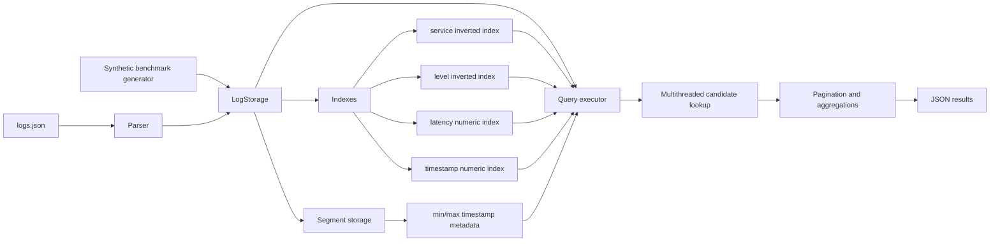

# Log Engine

A high-performance C++ log query engine for structured JSON logs. The project focuses on indexing, multithreaded query execution, aggregations, pagination, and benchmark-driven performance over million-scale generated datasets.

## Stack

- C++17
- STL containers and algorithms
- Multithreading with `std::thread`
- Node.js REST API wrapper, optional
- OpenAI Responses API for optional natural-language query translation

## What It Does

- Parses structured JSON logs into C++ `LogRecord` structs
- Stores logs in memory with fast ID lookup
- Builds inverted indexes for string fields:
  - `service`
  - `level`
- Builds numeric indexes for range filters:
  - `latency`
  - `ts`
- Supports filters joined by `AND`
- Supports:
  - naive full-scan execution
  - single-threaded indexed execution
  - multithreaded indexed execution
  - segmented indexed execution with timestamp-based segment pruning
  - multithreaded indexed candidate lookup
  - multithreaded aggregations
  - pagination
  - synthetic benchmark generation
- Aggregations:
  - `count`
  - `count_by_service`
  - `avg_latency_by_service`

## Build

From the project root:

```powershell
cd C:\Users\ryan0\OneDrive\Documents\Playground\log-engine
g++ -std=c++17 cpp/main.cpp cpp/parser.cpp cpp/storage.cpp cpp/index.cpp cpp/query.cpp -o cpp/log_engine.exe
```

## Query Examples

Optimized multithreaded indexed query:

```powershell
.\cpp\log_engine.exe --file data\logs.json --query "service = auth AND latency > 100"
```

Naive full-scan baseline:

```powershell
.\cpp\log_engine.exe --file data\logs.json --query "service = auth AND latency > 100" --mode naive
```

Optimized single-threaded indexed query:

```powershell
.\cpp\log_engine.exe --file data\logs.json --query "service = auth AND latency > 100" --mode indexed_single
```

Timestamp range:

```powershell
.\cpp\log_engine.exe --file data\logs.json --query "ts > 1713900002 AND ts < 1713900008"
```

Pagination:

```powershell
.\cpp\log_engine.exe --file data\logs.json --query "latency > 50" --page 1 --limit 3
```

Aggregation:

```powershell
.\cpp\log_engine.exe --file data\logs.json --query "level = ERROR" --aggregate count_by_service
```

## Benchmark

Generate synthetic logs in memory and compare naive full scans against single-threaded and multithreaded indexed execution:

```powershell
.\cpp\log_engine.exe --benchmark --count 1000000
```

Run a larger benchmark:

```powershell
.\cpp\log_engine.exe --benchmark --count 10000000
```

Run a segment-pruning benchmark:

```powershell
.\cpp\log_engine.exe --benchmark --count 10000000 --segment-size 1000000 --query "ts > 1723800000 AND level = ERROR AND latency > 1190"
```

Default benchmark query:

```text
level = ERROR AND latency > 1190
```

Recent 10M-log benchmark result:

```json
{
  "records": 10000000,
  "query": "level = ERROR AND latency > 1190",
  "ingestMs": 31214,
  "indexBuildMs": 49742,
  "naiveMs": 3696,
  "indexedThreadedMs": 219,
  "threadedSpeedupPercent": 94.0747,
  "matches": 6679
}
```

Recent 10M-log segment-pruning benchmark:

```json
{
  "records": 10000000,
  "query": "ts > 1723800000 AND level = ERROR AND latency > 1190",
  "segmentSize": 1000000,
  "segments": 10,
  "searchedSegments": 1,
  "naiveMs": 3770,
  "indexedThreadedMs": 86,
  "segmentedThreadedMs": 37,
  "segmentedSpeedupPercent": 99.0186,
  "segmentDeltaPercent": 56.9767,
  "matches": 65
}
```

## Optional Node API

The Node API is a thin wrapper around the C++ binary. It is useful for demos, HTTP querying, ingestion into `data/logs.json`, and optional natural-language query translation.

```powershell
cd C:\Users\ryan0\OneDrive\Documents\Playground\log-engine\api
npm run dev
```

Endpoints:

- `GET /health`
- `POST /ingest`
- `POST /query`
- `POST /ask`

Example query:

```powershell
$body = @{
  query = "level = ERROR AND latency > 100"
  page = 1
  limit = 10
} | ConvertTo-Json

Invoke-RestMethod -Uri http://localhost:3000/query -Method Post -ContentType "application/json" -Body $body
```

Natural-language query translation requires `OPENAI_API_KEY`:

```powershell
$env:OPENAI_API_KEY="your_api_key_here"
$body = @{
  question = "show me auth errors with latency above 100ms"
  execute = $true
} | ConvertTo-Json

Invoke-RestMethod -Uri http://localhost:3000/ask -Method Post -ContentType "application/json" -Body $body
```

## Architecture


